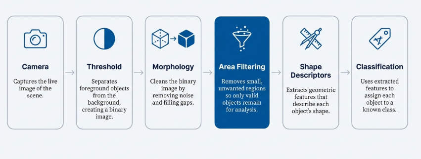
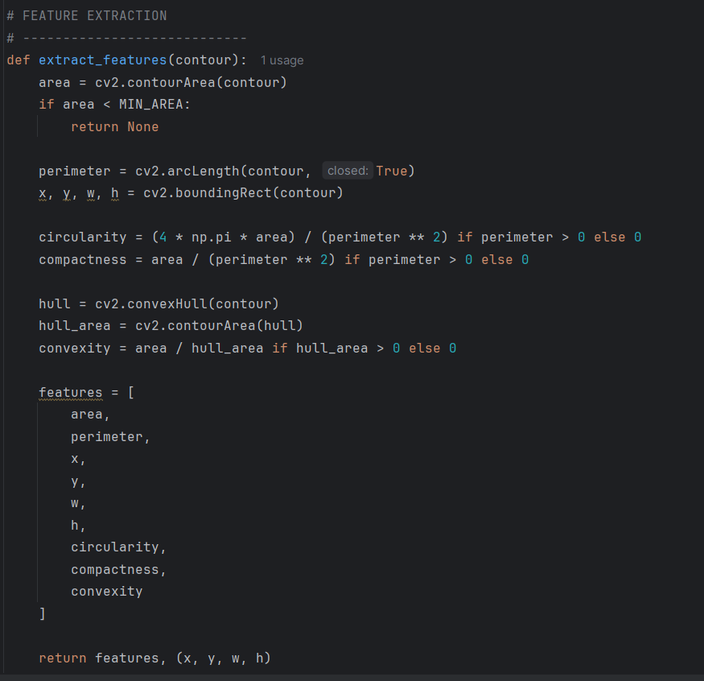

# Electronic Component Classifier — OpenCV + Decision Tree (Raspberry Pi)

A live computer-vision pipeline that watches a camera feed, isolates real objects from background noise, and identifies loose electronic and hardware parts by shape — bolts, nuts, washers, springs, diodes, resistors, ferrite beads, knobs, and wire — reporting each part's area, perimeter, circularity, compactness, and convexity alongside the predicted label, running on a Raspberry Pi with a USB webcam.

## Overview

Presented as "Area Filtering & Connected Components" (with Ali Hussain), this project combines classic image-processing techniques with a trained scikit-learn decision tree to turn raw camera frames into labeled part detections overlaid on the live video — essentially a camera-based parts sorter for a bin of mixed hardware.

## Pipeline

1. **Preprocessing:** convert each frame to grayscale, threshold to binary, and apply morphological closing to clean up the mask
2. **Contour extraction:** `cv2.findContours()` pulls out candidate object boundaries
3. **Area filtering:** discard any contour below a `MIN_AREA` threshold — this is the key noise-removal step, since a real detection pipeline gets hundreds of tiny spurious components (3–20 px) from sensor noise and imperfect thresholding before this filter is applied
4. **Feature extraction per contour:** area, perimeter, bounding box, circularity (`4π·area / perimeter²`), compactness (`area / perimeter²`), and convexity (`area / convex-hull area`)
5. **Classification:** the 9-feature vector is fed into a pre-trained decision tree (a scikit-learn bundle trained on `data/shape_database.csv`) to predict the part's label
6. **Overlay:** a bounding box and the predicted label plus its computed metrics are drawn directly on the live feed

## Training data

`data/shape_database.csv` holds ~600 labeled measurements (area, perimeter, bounding box, circularity, compactness, convexity) collected across 9 part classes: **Bolt, Diode, Ferrite Bead, Knob, Nut, Resistor, Spring, Washer, Wire**. This is what the decision tree in `model/` was trained on.

## Background: connected component labeling

This project builds on the classic two-pass connected-component labeling (CCL) algorithm: a first pass assigns provisional labels while recording label equivalences, and a second pass (union-find) resolves those equivalences into final per-blob labels — using 8-connectivity so diagonal pixels count as connected, which is standard for real-world blobs. The approach also draws on Otsu's thresholding (finds the split point in the valley of a bimodal brightness histogram) and why area-based filtering after labeling is what makes downstream shape descriptors stable instead of noisy.

## Contents

- `src/shape_detector.py` — live USB webcam pipeline: frame capture, thresholding, contour/area filtering, feature extraction, decision-tree prediction, on-screen overlay (press `Q` to quit and save the final annotated frame)
- `data/shape_database.csv` — the labeled training data (9 part classes, geometric features)
- `model/orange-workflow.ows` — a parallel classifier built the same dataset in [Orange Data Mining](https://orangedatamining.com/)'s visual workflow tool
- `model/decision_tree_model.pkcls` — that Orange-trained classifier, exported as a pickle (loadable with Orange installed; `shape_detector.py` expects its own scikit-learn `joblib` bundle trained from the same CSV instead)
- `images/` — the area-filtering pipeline diagram and a feature-extraction code excerpt

## Notes

`shape_detector.py` expects a scikit-learn `joblib` bundle (`decision_tree_model.joblib`, containing the trained tree, a label encoder, and the feature name list) trained from `data/shape_database.csv` and placed alongside it. The `.pkcls` file in `model/` is a separately-trained Orange Data Mining export over the same data, not a drop-in replacement.
